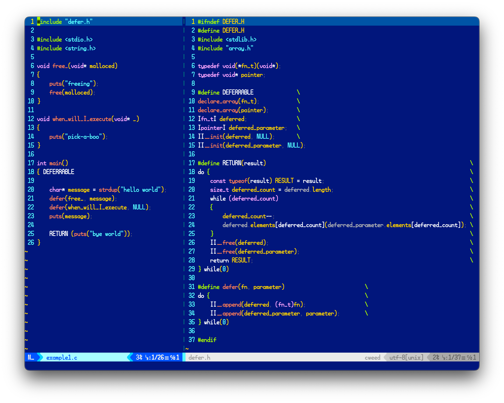

# defer.h
a lightweight `defer` feature C is missing.

```
hello world
bye world
peek-a-boo
freeing
```

# OVERVIEW
`defer` is a common programming language feature *(found in go, swift, zig...)* that defers execution of corresponding expressions *(though their parameters are executed immediately)* until the surrounding funtion returns, in [LIFO](https://en.wikipedia.org/wiki/Stack_(abstract_data_type)) order.

It can be used for many purposes, but the most significant usage would to clean up heap-allocated variables.

Combining `defer` with `malloc` is a strong memory management strategy that everyone should consider at least once.  

# USAGE
Copy and paste `defer.h` and `array.h` file, include them, and you'll get simple three macros *(alongside macros in array.h)*, `DEFERRABLE`, `RETURN`, and most importantly, `defer` *(this can be a regular function if you wish)*.  


```
hello words
freed two words
```

1) After the function curly brace opening, write `DEFERRABLE`; It declares necessary variables for `defer` to work.
1) `defer(void(*)(void*), void*)` takes a function pointer, and a pointer that passes onto the same function.
1) Use `RETURN` instead of the regular `return`; It evaluates the return expression, saves it, executes deffered functions that you've passed, and then return the previously saved return expression.
